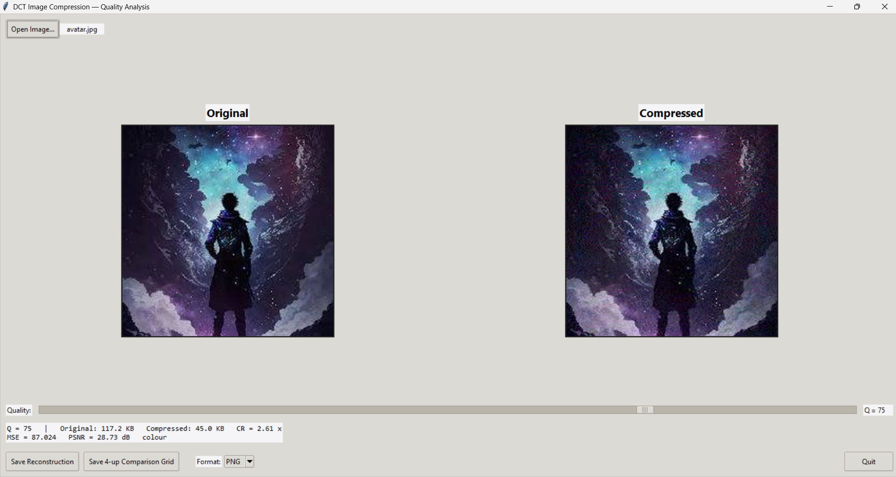
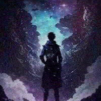
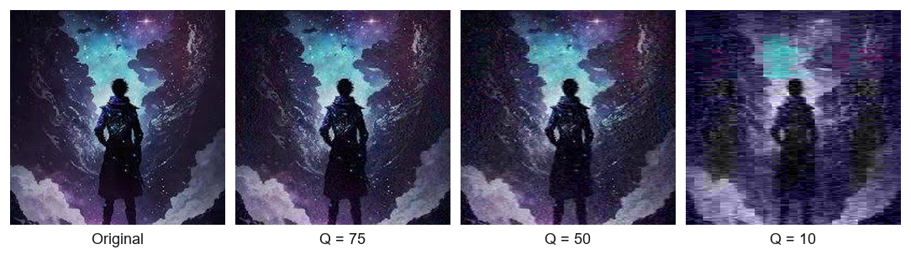

# DCT-Based Image Compression & Quality Analysis

A from-scratch implementation of JPEG-style lossy image compression using the
2-D Discrete Cosine Transform (DCT), with explicit measurement of the
storage-vs-quality trade-off via MSE, PSNR, and compression ratio.

> **One-line summary:** Take an image → split into 8×8 blocks → DCT →
> quantize (JPEG luminance table) → dequantize → inverse DCT → reconstructed
> image → measure the difference.

The math (DCT, IDCT, block splitting, quantization tables, MSE, PSNR) is all
implemented from scratch in NumPy. We do not call `scipy.fft.dct` so the
signal-processing chain stays visible for the live demo.

---

## Repository layout

```
.
├── dct_core/                  # DCT/IDCT math + quantization
│   ├── dct.py                 #   from-scratch 8×8 DCT/IDCT (single + batch)
│   ├── blocks.py              #   split image into 8×8 blocks, merge back
│   └── quant.py               #   JPEG luminance table, Q-scaling, quantize/dequantize
├── quality/                   # Quality metrics
│   └── metrics.py             #   MSE, PSNR, compression ratio, zig-zag byte estimator
├── pipeline/                  # End-to-end orchestration
│   ├── color.py               #   RGB ↔ YCbCr (BT.601 full-range)
│   └── pipeline.py            #   grayscale + colour compress_image entry point
├── io_utils/                  # Image I/O + 4-up comparison grid
│   └── io.py
├── app/                       # Tkinter GUI (optional, requires Tk)
│   └── gui.py
├── benchmarks/                # Quality-vs-size sweep over Q values
│   └── run_bench.py
├── tests/                     # 24 unit + integration tests
├── assets/                    # sample images (drop your own photo here)
├── main.py                    # CLI demo (single image)
├── requirements.txt
├── PROGRESS.md                # step-by-step easy-words diary
└── README.md                  # ← this file
```

## Install

```bash
python -m pip install -r requirements.txt
```

Tested on Windows + Python 3.10 with `numpy`, `Pillow`, `pytest`.

## How to run

### CLI demo (single image)

```bash
python main.py                                  # uses assets/sample.png, Q=75
python main.py my_photo.jpg                     # any image, default Q=75
python main.py my_photo.jpg -q 10               # very compressed, visible blocks
python main.py my_photo.jpg --no-color          # force grayscale pipeline
python main.py my_photo.jpg --grid              # also write a 4-up comparison grid
```

The console prints the full summary card (original size, compressed size,
compression ratio, MSE, PSNR) and saves `*_recon_q<Q>.png` next to the
input. With `--grid` it also saves a 4-up montage `*_comparison.png` of
`Original | Q=90 | Q=50 | Q=10`.

### Benchmark sweep (CSV over Q values)

```bash
python -m benchmarks.run_bench assets/sample.png --qs 5 25 50 75 95 --out benchmarks/results.csv
```

Dumps one row per Q with `quality, channel, mse, psnr_db, compression_ratio,
original_kb, compressed_kb`.

### Tkinter GUI

```bash
python app/gui.py
```

Open an image, drag the quality slider (1–100), and watch the right-hand
preview and metrics panel update live. Buttons save the reconstruction and a
4-up comparison grid.



> The GUI requires Tk. On a stock Windows / macOS Python install it just
> works. On minimal Linux distributions install `python3-tk`.

### Tests

```bash
python -m pytest tests/ -v
```

24 unit + integration tests covering DCT round-trip, quantization error
bounds, MSE/PSNR, the full grayscale pipeline, the colour pipeline,
and PNG I/O round-trip.

---

## The signal-processing chain

```
Input image (uint8, H × W × {1|3})
       │
       ├── grayscale ─────────────────►  level-shift by −128
       │                                   │
       └── colour (RGB) ─► RGB → YCbCr ───► split into 8 × 8 blocks (reflect-pad if needed)
                                          ▼
                                  2-D DCT per block (vectorized)
                                          ▼
                          quantize: round(coefficients / table)
                                          ▼
                          dequantize: qcoeffs × table
                                          ▼
                                inverse 2-D DCT per block
                                          ▼
                                  merge blocks back into image
                                          ▼
                                  inverse level-shift (+ 128)
                                          ▼
                                  clip to [0, 255], cast to uint8
                                          ▼
                          compare to original → MSE, PSNR, CR
```

### Why DCT?

Real images are mostly *slowly varying*. The DCT packs most of the signal
energy into a small number of low-frequency coefficients (top-left of each
8×8 block) and leaves the rest mostly near zero. The quantization table is
chosen to round those near-zero high-frequency coefficients aggressively
while preserving the bright top-left coefficients — exactly the asymmetric
treatment the human visual system is most tolerant of.

### Why Q=50?

Q=50 is the JPEG *reference* quality. The quantization table hard-coded in
`dct_core/quant.py` is the standard JPEG luminance table at Q=50. The same
table can be re-scaled for any Q in [1, 100] using `scale_table`.

### What "compression ratio" means here

We compare against the *raw pixel size* (one byte per pixel for grayscale,
three bytes per pixel for RGB) — the honest baseline that lets you see how
much your DCT pipeline is shrinking the data, independent of the
PNG/ZIP wrapper on top.

---

## Quality metrics

| Metric | Definition | Notes |
|--------|-----------|-------|
| MSE | `mean((original − reconstructed)²)` | Lower is better. |
| PSNR | `10·log10(255² / MSE)` dB | Higher is better. `inf` for lossless. |
| CR   | `original bytes / compressed bytes` | Higher is more compression. |

Typical measured values (the colour sample in `assets/sample_color.png`):

| Q    | CR (×) | MSE    | PSNR (dB) | Visual feel           |
|------|-------:|-------:|----------:|-----------------------|
| 5    | 17.78  | 932.40 | 18.43     | heavy blocking, poster |
| 25   |  8.12  | 350.69 | 22.68     | visible 8×8 squares    |
| 50   |  5.88  |  96.83 | 28.27     | small visible artifacts|
| 75   |  4.61  |  57.28 | 30.55     | nearly indistinguishable|
| 95   |  2.33  |  39.56 | 32.16     | visually lossless      |

---

## Project structure (formal spec)

The formal specification lives in
[`requirements/specs/dct-image-compression/`](requirements/specs/dct-image-compression/):

- `spec.md` — requirements, math, and 50% milestone definition.
- `tasks.md` — the 12-task build list (all checked off).
- `checklist.md` — verification checkpoints.

`PROGRESS.md` is the easy-words step-by-step diary of how the 50% and 100%
milestones were built.

---

## How to extend

- **Chroma quantization at higher fidelity:** change `Q_chroma = Q // 2` in
  `pipeline/pipeline.py` to `Q`.
- **Real Huffman coding:** replace `estimate_compressed_size` in
  `quality/metrics.py` with a Huffman pass to report actual bitstream size.
- **YUV 4:2:0 chroma subsampling:** subsample Cb and Cr by 2× before
  quantization, then upsample before YCbCr → RGB.
- **Better entropy coding:** add a baseline-JPEG Huffman table for AC
  coefficients and emit an actual `.jpg`-like byte stream.

---

## How It Works Internally (Simply Explained)

Real JPEG compression has two major halves: The **Signal Processing** (The Math) and the **Binary Encoding** (The File). This project focuses entirely on the Signal Processing half, allowing you to see exactly how the math works!

1. **Color Conversion (YCbCr):** The human eye is very sensitive to brightness but bad at noticing tiny color changes. We separate the image into Brightness (Y) and Color (Cb, Cr) so we can compress the color more heavily.
2. **Block Splitting:** The image is chopped into tiny 8x8 grids of pixels.
3. **Discrete Cosine Transform (DCT):** Instead of looking at 64 individual pixels, DCT transforms them into **frequencies** (like sound waves). It groups the smooth, broad colors into the top-left and pushes the sharp, tiny details to the bottom-right.
4. **Quantization (The Compression):** This is where the Quality (Q) slider comes in. The algorithm divides the DCT numbers by a standard table and rounds them down. All the tiny details (high frequencies) round down to **Zero**. By turning details into zeros, we throw them away and save massive amounts of space!
5. **Reconstruction (IDCT):** To view the image again, we do the math in reverse. Because we rounded numbers to zero, the original detail is permanently lost, which causes the "blocky" artifacts you see at low Quality levels.

---

## Examples

Below are examples generated directly from the tool, showcasing both JPG and PNG export formats, as well as the 4-up comparison grid.

### Single Reconstruction
Here is a reconstructed image saved directly from the tool:


### 4-Up Comparison Grid
The tool can automatically generate a grid showing the Original image compared against Q=90, Q=50, and Q=10 to visually demonstrate the degradation in quality as the file size shrinks:



